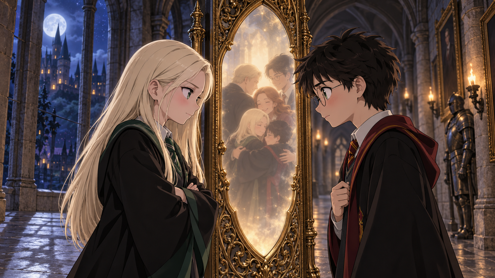
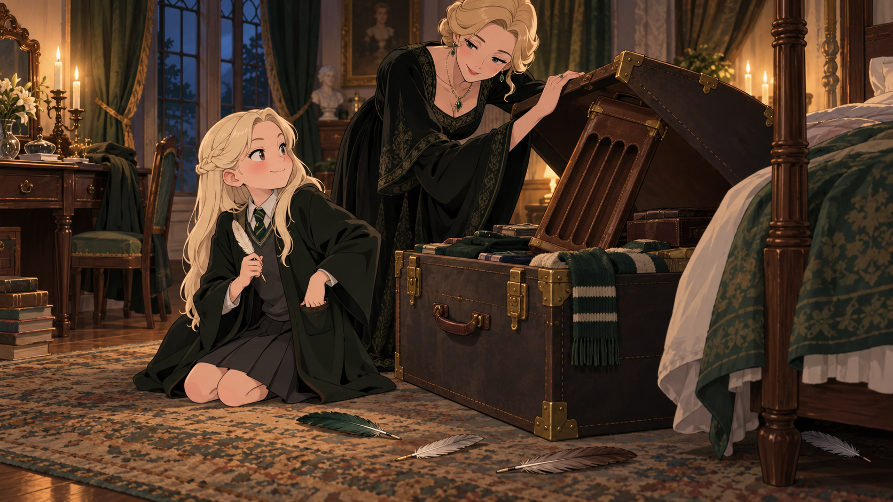
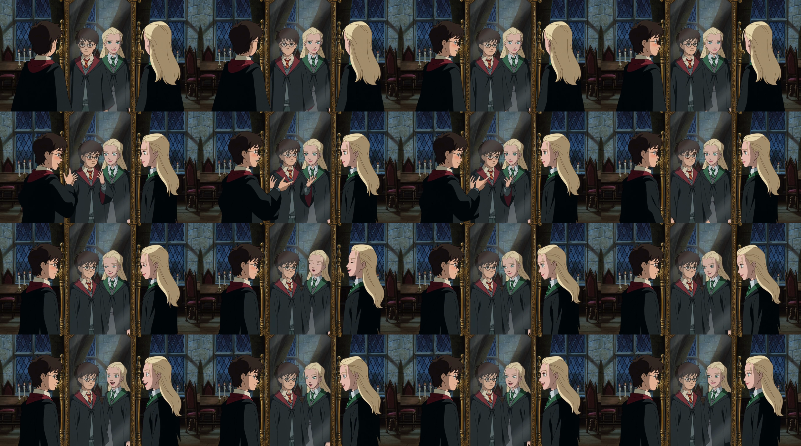

# Malfoid

## [Join the Malfoid Discord](https://discord.gg/6SYAbr6YsT)

**Meet the community, share scene ideas, and follow the anime feature as it takes shape.**

**What if Draco Malfoy had been a girl all along?**

Meet Draconia Malfoy: proud, razor-witted, and determined to beat Harry at his own game. At Hogwarts, every clash sparks another challenge—and their rivalry starts to feel a lot like a crush. Suddenly there’s much more at stake than points, pride, or the next clever comeback.

Malfoid reimagines *Harry Potter and the Philosopher’s Stone* as a feature-length anime, with Draconia and Harry sharing the lead. Her own ambitions, friendships, mistakes, and decisions shape the adventure, alongside sharp comedy, awkward kindness, and an age-appropriate first-year crush.

## The goal

Bring the whole first-film adventure to life as anime, scene by scene—from script and character design to voices, storyboards, animation, music, and sound.

## See and read Malfoid

[Watch the 15-second silent anime scene preview](media/video/mirror-erised-v5-silent-preview.mp4) · [Read how the media was made](media/README.md)

- [Four Spare Quills](stories/four-spare-quills.md) — Draconia packs four extra quills for three classmates she has not met yet.
- [One Race](stories/one-race.md) — Draconia and Harry try to restart their rivalry after an argument.

## Feature checklist

- [x] **Preview the anime direction:** a 15-second visual-only Mirror of Erised scene is ready to watch above.
- [ ] **Lock the story and script:** shape the full feature so Draconia has her own goals, relationships, and choices throughout the adventure.
- [ ] **Finish the anime design bible:** settle character sheets, expressions, costumes, Hogwarts locations, props, color, lighting, and spell effects.
- [ ] **Set the voices and sound:** finalize performances and pronunciation; plan dialogue recording, music, effects, and the final mix.
- [ ] **Break the script into scenes and shots:** assign stable IDs, plan each scene's emotional turn and camera work, then board and time it in an animatic.
- [ ] **Make the scene workflow repeatable:** take a scene from approved script and designs through voices, animation, compositing, and review; record the tools, inputs, effort, and reusable sources.
- [ ] **Build the feature scene by scene:** animate and assemble each shot, reusing approved designs and locations while checking continuity across the film.
- [ ] **Finish and review the feature:** complete editing, music and sound, captions, credits, and a full-film picture and audio review.
- [ ] **Release the project in parts:** publish story, artwork, video, workflows, and tools with their creators, sources, and reuse terms documented.

## Help build it

Pick a task above, pitch a scene, or help shape the anime look. [Open an issue](https://github.com/stale2000/Malfoid/issues/new) to share an idea or discuss how to take on a task; [read the contribution guide](CONTRIBUTING.md) before sending work.

A great first contribution: pitch a Draconia-and-Harry scene with a clear goal, conflict, and emotional turn.

[Explore the production plan](docs/production-plan.md) · [Browse story ideation and working drafts](creative/README.md) · [Read about the local source movie](docs/source-material.md)

*An unofficial fan project. The source film stays local and is not included here. See [licensing notes](LICENSES.md) for asset terms and credits.*

Maintained by [@stale2000](https://github.com/stale2000).
